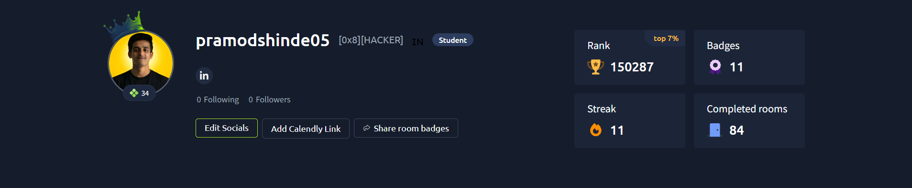
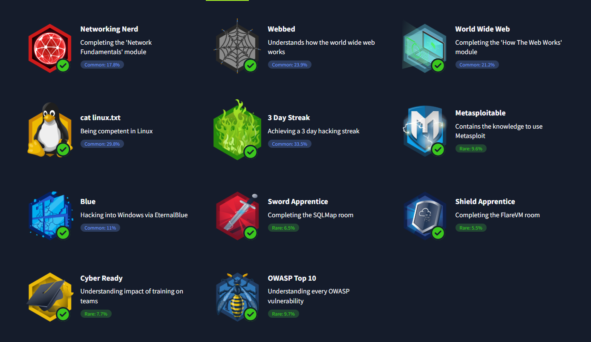

<h1 align="center">Pramod Shinde</h1>

  Cloud Security • Detection Engineering • Security Automation

  

<!-- SOCIAL BADGES & VISITS -->

  
  &nbsp;
  
  &nbsp;
  
  &nbsp;
  

<!-- ANIMATED CYBER BANNER -->

  

<!-- CYBERPUNK DIVIDER -->

  

## ⚡ Root Console: About Me

I'm a Cyber Security student focused on Defensive Security Engineering, Cloud Security, Detection Engineering, and Security Automation.

* 🎯 **Objective**: Building systems to understand how attacks operate, how systems fail, and how defenders can construct practical controls to improve visibility, reduce risk, and build infrastructure resilience.
* 🛠️ **Current Projects**: Constructing security tools in Python, hardening Linux systems, designing Zero Trust environments, and exploring modern cloud architectures.

---

## 🛠️ Technical Stack & Frameworks

  

| Domain | Technologies |
| :--- | :--- |
| **🛡️ Cloud Security** | Google Cloud Platform, IAM policies, Cloudflare, Zero Trust Architecture |
| **🔍 Defensive Security** | Threat Detection, Threat Hunting, Endpoint Auditing, Linux Hardening |
| **🐍 Programming** | Python, Bash, JavaScript |
| **🤖 Security Automation** | Selenium, Playwright, Python Web Scraping & scripting |
| **🌐 Web Development** | Flask, HTML5, CSS3 |
| **📦 DevSecOps** | Docker, Git, GitHub Actions |
| **💾 Databases** | PostgreSQL, MySQL, SQLite, Supabase |
| **🐧 Operating Systems** | Linux (Ubuntu, Kali Linux) |

<!-- HOLOGRAPHIC DIVIDER -->

  

## 📜 Certifications & Internships

### 🎓 Google Cybersecurity Professional Certificate
* **Key Domains**: Security Operations (SecOps), Incident Response, Network Defense, Python Automation, SQL Analysis, Risk Management.
* 🔗 [Credentials Verification](https://www.linkedin.com/posts/pramod-shinde-56984b378_cybersecurity-googlecybersecurity-coursera-activity-7466812172111900672-9ybL)

### 🐧 TryHackMe Pre Security Certificate
* **Key Domains**: Networking Fundamentals, Operating Systems, Web Technologies, Cybersecurity Basics.
* 🔗 [Credentials Verification](https://www.linkedin.com/posts/pramod-shinde-56984b378_cybersecurity-tryhackme-presecurity-activity-7468975675228672001-dobc)

### 💼 Tata Cybersecurity Analyst Job Simulation (Forage)
* **Key Domains**: Identity & Access Management (IAM), Infrastructure Review, Security Architecture Analysis, Risk Assessment.
* 🔗 [Credentials Verification](https://www.linkedin.com/posts/pramod-shinde-56984b378_cybersecurity-iam-forage-activity-7364332450430283789-Vjg4)

### 🔍 CyberZero Internship
* **Key Domains**: Defensive security operations, vulnerability assessment, ethical hacking.
* 🔗 [Credentials Verification](https://www.linkedin.com/posts/pramod-shinde-56984b378_cybersecurity-ethicalhacking-internship-activity-7385257459050823680-Rykd)

### 💻 Unified Mentor Pvt. Ltd. (Cyber Security Intern)
* **Key Domains**: Host Monitoring, Security Auditing, Vulnerability Assessment, Security Operations.
* 🔗 [Credentials Verification](https://www.linkedin.com/posts/pramod-shinde-56984b378_cybersecurity-internship-learning-activity-7424368972575408129-aQNi)

<!-- CYBERPUNK DIVIDER -->

  

## 🕹️ TryHackMe Security Labs & Badge Collection

  

  

<!-- HOLOGRAPHIC DIVIDER -->

  

## 📁 Featured Security Repositories

  
  &nbsp;&nbsp;
  

  
  &nbsp;&nbsp;
  

<!-- CYBERPUNK DIVIDER -->

  

## 📊 System Diagnostics & Analytics

  
  &nbsp;&nbsp;
  

  

  

---

## 🧠 Security Philosophy

> "Security is not a product or a checklist. It is a continuous process of observation, analysis, adaptation, and engineering resilient systems against evolving threats."
